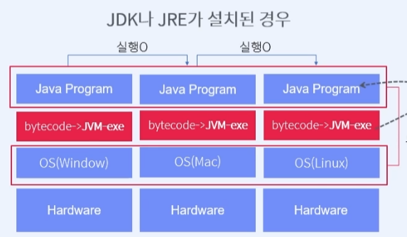
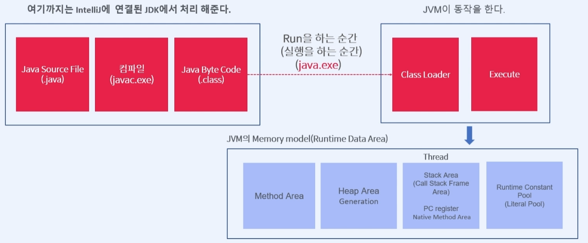

# Course1 Part2 자바 기초

## 자바 SE프로젝트 구조

##### 자바는 객체지향언어
> 객체(Object)단위로 프로그래밍을 해야 한다: 인간 중심 관점
> 클래스(Class)단위로 프로그래밍을 해야 한다: 프로그래밍 관점

##### Java메인 클래스(시작 클래스)만들기
> 다양한 클래스가 존재할 수 있지만 프로그램의 시작을 알리는<br/>
> 메인 클래스(main 메서드를 가진 클래스)는 딱 1개만 존재한다

##### JavaSE 프로그램의 기본 골격
```java
public class Calculator{ //클래스
    public static void main(String[] args) {//메서드
        //메서드는 동작을 처리하는 함수(function)이다
        //메서드 내부에서는 동작을 구현한다
    }
}
```
##### 프로젝트 구성요소
> out: 실행코드의 집합(.class)<br/>
> src: 소스코드(.java)<br/>
> External Libraries: 자바에서 제공해주는 API(클래스들의 집합)

.java 파일은 컴퓨터가 실행할 수 없기 때문에 컴파일러를 통해
.class파일로 변환시켜 실행한다

터미널에서도 디렉토리를 보고 컴파일과 실행을 할 수 있다
> 컴파일: javac.exe -d (java디렉토리) (클래스.java)<br/>
> 실행: java.exe -classpath (class파일 디렉토리) (클래스명)

## JVM과 자바의 구동방식
##### JVM이란 무엇인가?(JVM을 알면 자바의 특징을 알 수 있다)
##### 자바의 특징
>- Java는 플랫폼(OS) 독립적인 개발이 가능하다<br/>
>- 자동으로 메모리를 관리해준다

##### JVM의 구동방식
<p align="center">
   
<p/>

>- 각 pc위에 OS가, 그 위에 JVM이 설치된다   
>
> 
>- Javac가 컴파일할때 bytecode(중간어코드)로 만들어 두는데 이는 어떤 
> OS위에서 실행할지 모르기 때문에 exe코드로 만들지 못한 것이다
>
> 
>- 이후 JVM이 OS에 맞게 한 번 더(2차) 컴파일하여 메모리에 로딩한 후 실행한다
>
>
>- 만약 윈도우애서 1차 컴파일된 .class파일을 맥os에서 실행할 경우 JVM이 맥os에 맞춰 2차 컴파일하여 실행한다

- 다른 언어의 경우 각 os에 맞게 exe로 컴파일 되기 때문에 os에 종속적이다

##### JVM 구동방식의 이해
<p align="center">
   
<p/>

> - javac 컴파일러를 이용해 .java파일을 .class bytecode로 1차 컴파일한다
>
>
> - IDE에서 Run을 하는 순간 RPC(원격프로세서호출)을 통해 JVM을 동작시킨다
>
> 
> - 이때 JVM이 아래의 메모리 영역을 사용, 관리한다   
>       - Method Area   
>       - Heap Area   
>       - Stack Area   
>       - Runtime Constant Poll