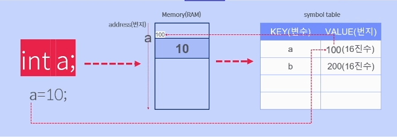

# Course1 Part2 자바 기초

### 목표
> 프로그래밍의 3대 요소인 변수, 자료형, 할당이 무엇인지 이해하고 관계를 파악
### 프로그래밍의 3대 요소
- 변수(V): 데이터를 저장하는 메모리 공간의 이름(symbol)
- 자료형(D): 변수의 크기와 종류를 결정하는 것
- 할당(A): 변수에 데이터를 저장하는 것

> 변수+자료형 = 변수 선언

### 변수 이름 규칙
>- 숫자로 시작할 수 없다.
>- 대소문자 구분되며, 길이에 제한이 없다.
>- $와_이외의 특수문자는 사용할 수 없다.
>- 키워드(예약어)는 변수이름으로 사용할 수 없다. ex) int, double

### 변수의 종류
>- 멤버변수(인스턴스 변수 = instance variable)
>- 클래스변수(static variable)
>- 지역변수(local variable)
>- 매개변수(parameter, argument)

### 변수의 심볼 테이블
##### 변수를 관리하는 테이블

    

> 변수가 만들어지면 변수를 관리하는 테이블에 변수 정보가 저장된다.
>
> 왜 관리를 해아하나? - 변수가 메모리에 만들어 지기 때문
> 
> 해시테이블로 구성됨(key와 value로 검색 용이)
---

### 자료형의 종류   
#### 기본자료형의 종류

>- byte(1byte): 정수형, default value = 0
>- short(2byte): 정수형, default value = 0
>- int(4byte): 정수형, default value = 0
>- long(8byte): 정수형, default value = 0
>- float(4byte): 실수형, default value = 0.0f
>- double(8byte): 실수형, default value = 0.0d
>- char(2byte): 문자형, default value = \u0000, null
>- boolean(1byte): 참,거짓, default value = false

#### 사용자정의 자료형(객체자료형)
> 책, 강의, 회원 등 사용자가 직접 정의한 클래스를 기반으로한 객체형태의 자료형
---
### 할당
> 변수에 지정된 데이터타입에 맞게 데이터를 저장(대입)하는 행위
> - int a = 10; 
> - int b = a;

### 초기화( 초기화 안하면 쓰레기값 들어감, 연산불가)
> 변수를 만들고 난 후 연산을 하기 전에 값을 저장하는 행위
> 

