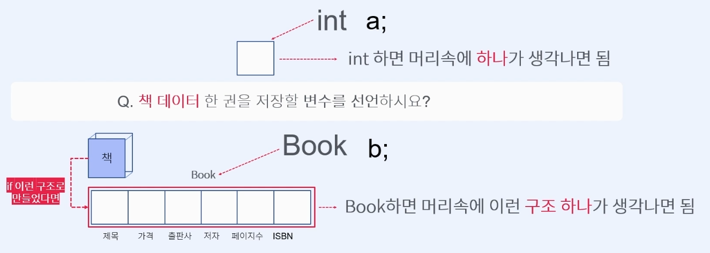

# Course1 Part2 자바 기초   

## 객체와 클래스

### 목표
> 하나의 변수로 표현할 수 없는 데이터들을 표현하기 위한 사용자정의자료형인 객체와 클래스에
> 대해 이해하고 생성, 사용법을 익혀보기

---

##### 새로운 자료형이 필요한 이유
> 개발자가 다루는 데이터는 거의 객체(Object)데이터 이다   
> 객체데이터는 하나의 구조(하나의 변수)로 이루어진 단순한 데이터가 아니다   
> 현실에서는 여러 개의 구조(여러 개의 변수)로 이루어진 데이터가 필요하다   
> 이런 객체 데이터를 변수에 저장하기 위해서는 새로운 자료형이 필요하다
>    
> => 따라서 개발자는 직접 데이터의 특성에 맞는 자료형을 만들어 사용한다(객체지향프로그래밍)

##### 장점?
> 여러개의 데이터가 클래스라는 바구니에 담겨 이동하기 때문에 이동이 효율적이며 관리가 쉽다.

##### 새로운 자료형 만들기
