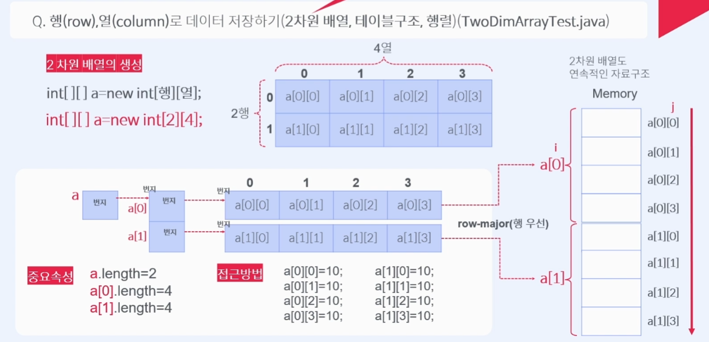

# Course1 Part2 자바 기초   

## 배열

### 목표
> 한개의 데이터가 아닌 여러개의 데이터를 다루는 배열(array)에 대한 개념, 생성, 사용법 익히기
---
### 배열이란?
>배열은 자료구조의 일종이다(선형 구조, 연속적인 구조)
> 
>기본적으로 배열은 선형 구조이지만 이런 선형구조가 모여 다차원 배열을 형성할 수 있다   
>   
>일반적으로 많이 쓰는 2차원 배열의 경우 행렬과 같이 가로행을 row(행) 세로를colum(열)로 정의하고
사용한다

##### *배열은 같은 타입의 데이터로 이루어진다   
##### 우리가 일반적으로 사용하는 String이 문자의 배열로 이루어진 사용자정의자료형

---
### 배열의 형태
```java
int[] number; //[]는 배열표시, 객체 생성시 배열의 크기를 지정하여 생성함
int[] number = new int[30]//30개의 int자료형을 저장할 수 있는 배열객체 생성
```
> 자바에선 배열을 객체로 취급   

만약 배열을 사용하지 않고 정수n개를 개별로 선언하면?
> 불 연속적인 데이터가 생성되기 때문에 반복문, 데이터 이동, 선언, 비교, 관리 등에서 불편함 발생

배열의 메모리 공간의 번호를 index라고 하며   
index는 0부터 개수-1까지 존재

---
### 배열의 사용
> 배열의 크기가 작을 경우 개별적으로 관리가 가능하지만   
> 크기가 클 경우는 반복문을 통해 관리한다

##### 예시코드(개별 관리)
```java
//정수 5개를 저장 할 배열을 생성하고 10으로 초기화
int[] a = new int[5];
a[0] = 10;
a[1] = 10;
a[2] = 10;
a[3] = 10;
a[4] = 10;
```

##### 예시코드(반복문 활용)
```java
//정수 5개를 저장 할 배열을 생성하고 10으로 초기화
//배열의 각 방 접근은 배열명[index]
int[] a = new int[];
//length - 배열의 길이를 구하는 속성
for(int i = 0; i < a.length; i++){
    a[i] = 10;
}
```

### 기본배열과 객체배열
> 기본자료형 이외의 사용자정의자료형(class), 즉 객체를 배열의 데이터값으로
> 사용해야하는 상황이 자주 발생하기 때문에 알아둬야 한다

##### 예시코드(기본배열)
```java
float[] f = new float[];
f[0] = 17.4f;
f[0] = 18.4f;
f[0] = 19.4f;
//각 방에 같은 자료형 데이터1개씩 들어있음 
```

##### 예시코드(객체배열)
```java
//아래와 같이 객체를 생성하면 b1,b2,b3는 연관성 없이 전부 개별적인 데이터가 된다
Book b1, b2, b3;
b1 = new Book();
b2 = new Book();
b3 = new Book();

//하지만 아래와 같이 배열의 형태로 담아둘 수 있다면 복잡한 데이터들의 관리가 용이하다
Book[] b = new Book[3];
b[0]=new Book();
b[1]=new Book();
b[2]=new Book();
```
---
### 이미지를 표현하는 2차원 배열
3명의 학생의 3개 과목 성적을 처리해야 하는 경우는 어떻게 해야하나?   
픽셀 구조로 이루어진 이미지를 처리하기 위해서는 어떻게 해야하나?   

위와 같이 선형구조만으로는 처리할 수 없는 경우가 자주 발생한다

다음 두 경우의 차이점은?
```java
int[] kor = new int [3];
int[] eng = new int [3];
int[] math = new int [3];
```
```java
int[][] score = new int[3][3];
```

> 위의 코드의 경우 결과적으로 표현하려는 자료값은 같지만   
> 배열간 연관관계가 명확하지 않아 향후 데이터를 처리 및 가공할 때 불편함이 있다   
> 하지만 아래의 경우 행은 학생, 열은 과목 처럼 연관관계에 따른 데이터 처리가 가능하다는 차이가 있다   
> 이러한 특성은 영상처리에서 이미지를 처리할 때 주로 사용된다

##### 2차원 배열의 선언
> 자료형[ ][ ] 변수명 = new 자료형[행][열];

##### 코드
```java
int [][] a = new int [2][3];
```
---
### 2차원 배열의 메모리 구조
> 2차원 배열은 배열의 배열이라고 불리기도 하며 일반적으로 데이터 테이블 구조처럼 보일 수 있지만
> java의 2차원 배열은 메모리 상에서 연속적인 자료구조이다   
> 
> java의 배열의 경우 실제 메모리 상에서는 다음과 같이 표현된다
>
>    

##### 2차원 배열에서의 length 속성
-int [ ][ ] a = new int [2][4];인 경우
> a.length = 2 행의 개수   
> a[0].length = 4 열의 개수

