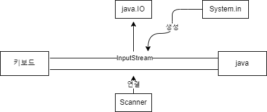

# Course1 Part2 자바 기초   

## 논리적인 사고력 키우기

### 목표
> 각종 연산자 및 명령문 학습을 통한 논리적 사고력 키우기
---
### Scanner(스캐너) - 데이터 입력받기
#### 논리적 사고력을 키우기 위해서 데이터 입력 받는 법 알아두기
*키보드로부터 데이터를 입력받는 방법(java.util.Scanner이용)
```java
Scanner sc = new Scanner(Sysyem.in); sc.close;
```
> - nextInt(): 정수입력
> - nextFloat(): 실수입력
> - nextDouble(): 실수입력
> - next(): 문자열입력(공백 앞까지 입력 받음, 즉 공백이 구분자)
> - nextLine(): 문자열입력(엔터까지 입력받음)

*Scanner란?
>JDK 설치시 JVM, TOOL과 함께 제공되는 API의 한 종류로 util 패키지 안에 존재한다   
> Scanner는 키보드 장치(System.in, 입력스트림)를 생성자의 매개변수로 호출하여 키보드에서 입력한 값을 받는 기능을 한다
>
> Scanner의 작동 구조는 다음과 같다
>
>
>    
> - Scanner 객체 생성시 System.in을 생성자 매개변수로 넘겨주면 InputStream(java.IO)이 열려 외부장치와 연결된다   
>
>
> - 열린 InputStream에 Scanner가 연결되어 입력받은 데이터를 처리한다

---
### 연산자
#### 연산자의 종류
>- 단항연산자: ++(전위,후위),--(전위,후위)
>- 삼항연산자: 조건 ? 참 : 거짓
>- 산술연산자: +,-,/,*,% (이항연산자라고 부르기도 함)
>- 관계연산자: >,<,>=,<=,==,!=
>- 논리연산자: &&,||,!
>- 복합대입연산자: +=, -=, *=, /=, %=

##### 1. 단항연산자
>- 증가연산자(++): ++a(전위), a++(후위)   
>- 감소연산자(--): --a(전위), a--(후위)
>
> 전위: a의 값 1증가 -> 이후 a값 사용(증가가 사용보다 먼저 이루어짐)   
> 후위: a의 값 사용 -> 이후 a값 1증가(사용한 이후 증가가 이루어짐)

##### 2. 삼항연산자
> (조건식) ? A : B의 형태 (연산자의 수가 3개)
> - 조건식이 참: 결과값 a
>   - ex) a < 0 ? - a : a &nbsp;&nbsp;&nbsp; => 절대값 계산 
> - 조건식이 거짓: 결과값 b
>   - ex) a < b ? a : b &nbsp;&nbsp;&nbsp; => 둘 중 작은 값 계산


##### 3. 산술연산자
+, -, *, /, % 가 대표적인 산술연산자이며 연산형태에 따라 결과가 달라진다
>- 정수형과 실수형: 결과는 정수형
>  - ex) 5 / 2 = 2 (정수형)
>- 실수형과 실수형: 결과는 실수형
>  - ex) 5.0 / 2.0 = 2.5 (실수형)
>- 정수형과 실수형: 결과는 실수형
>  - ex) 5 / 2.0 = 2.5 (실수형)
>- 연산자 /(몫): 정수인지 실수인지에 따라 달라진다
>  - 정수ex) 11 / 4 = 2 (몫만 취한다)
>  - 실수ex) 11.0 / 4.0 = 2.75

##### 4. 대입연산자
연산자 우측 수식의 값을 왼쪽 변수에 대입하는 연산자
> 변수(L-Value) = 수식(R-Value)
> - ex)


##### 관계연산자

---
### 명령문
#### 명령문의 종류
>- 조건문: if, if~else
>- 선택문: switch~case
>- 반복문: for, foreach, while, do~while
>- 제어문: break, continue

##### 조건문


##### 반복문


##### 제어문