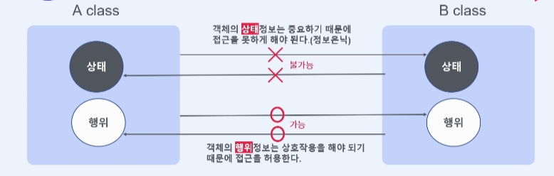
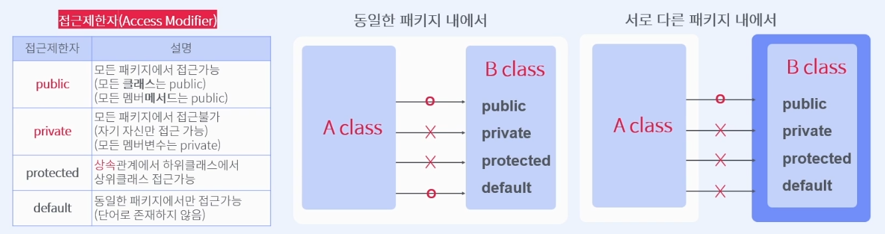

# Course1 Part3 객체지향 프로그래밍 시작   

## 접근권한

### 목표
> 객체지향프로그래밍에서는 객체 상호간의 접근을 제어할 수가 있어야 한다.   
> A,B 두 클래스가 가지고 있는 상태와 동작에 대한 접근을 허용 할 수 있어야 하고   
> 동시에 접근을 막아야 하는 경우도 있는데 이러한 접근을 제어하는 방법에 대해 학습한다
---
### 접근제어(Access Modifier)란?
> ##### 객체 보호를 위한 수단
> </img>
> *접근을 함부로 허용하면 잘못된 정보가 저장되거나 잘못된 동작이 발생할 수 있다      
>- 객체 상호간에 접근을 제어하는 방법 => 4가지 제한자를 사용한다
>- 클래스를 설계할 때 반드시 고려해야 한다
>- 클래스와 내부에서 만들어지는 멤버에 접근 제한자를 사용할 수 있다

##### 접근제어자의 종류
> 

### 패키지(package)란 무엇인가?

### 클래스를 접근하는 방법 2가지
