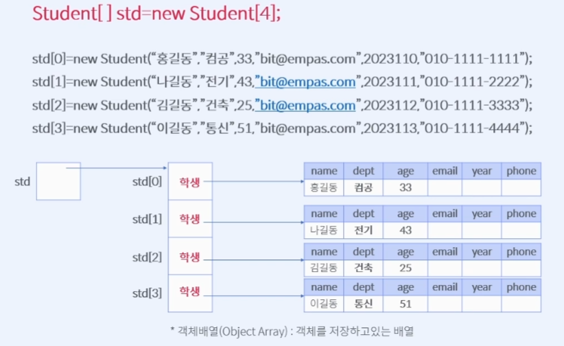

# Course1 Part3 객체지향 프로그래밍 시작   

## 배열과 클래스의 관계

### 목표
> 배열과 클래스는 데이터를 담는다는 역할에서는 같지만 만들어지는 구조는 다르다   
> 배열은 동일한 데이터를 담는 동일한 구조, 클래스는 서로 다른 데이터를 담는 일적인 구조다   
> 배열과 클래스를 비교하여 다양한 실습을 해보자
---

### 동일한 구조와 이질적인 구조
> 배열과 클래스 모두 Object라는 성질은 같지만   
> 클래스는 이질적인 데이터, 배열은 동일한 데이터를 담는다는 구조적 차이가 있다

---

### 기본배열과 객체배열의 관계
> 일반적인 기본자료형의 배열은 각 요소에 데이터 1개의 값이 들어있다   
> 하지만 배열의 요소가 객체라면 각 요소에 해당 객체의 주소값이 들어있다
> 
> 
> 객체배열의 메모리 구조는 다음과 같다
> </img>

