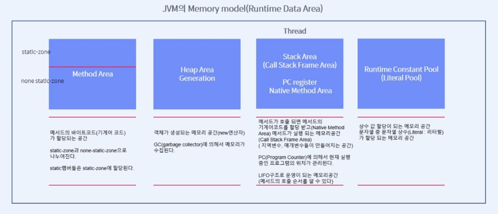

# Course1 Part3 객체지향 프로그래밍 시작   

## static과 JVM메모리 모델 이해하기

### 목표
> static 키워드와 메모리 관계를 이해하고 JVM에 사용하는 메모리 모델(4가지)을 통해   
> 자바 프로그램이 어떻게 구동되는지 원리를 학습한다
---

### static과 메모리의 관계

##### 왜 시작클래스(메인클래스)는 new없이 객체가 생성되나?
> 메인클래스가 동작되는 방식은 다음과 같다
> 1. JVM이 실행할 클래스를 찾는다. 찾았다면?
> 2. static 키워드가 붙어있는 멤머들을 정해진 메모리(static-zone)위치에 한 번 자동으로 로딩한다
>    - static멤버들은 클래스를 사용하는 시점에서 딱 한번 메모리에 로딩된다는 점이 중요
>    - 여기서는 main() 메서드가 static이기 때문에 메모리에 자동으로 로딩됨
> 3. JVM이 static-zone에서 main()메서드를 호출한다
> 4. 호출된 메서드를 Call Stack Frame Area(Stack Area)에 push(기계어코드를 넣고)한 뒤 동작을 시작한다
> 
> </img>

---

### static과 none static멤버들의 접근방법

##### static 멤버에 접근하는 방법
> 클래스이름.호출메서드();

##### none-static 멤버에 접근하는 방법
> 객체생성 후 객체명.메서드();

---
### JVM의 메모리 모델
</img>

---
### 객체생성과 static의 관계
어떤 클래스의 모든 멤버가 static 멤버인 경우를 생각해보자
> static의 경우 객체가 만들어지지 않아도 static-zone에 로딩되기 때문에   
> main에서 클래스명.메서드()로 호출이 가능하다      
> 따라서 객체를 만들 필요가 없다 => 객체생성을 막을 수 있다   
> 객체 생성을 막는 방법? => 생성자를 private 처리
> 생성자는 반드시 public이다? => X, System.Math등이 private 생성자를 가진 예시
