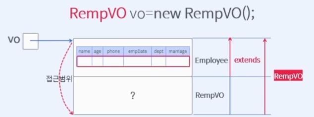

# Course1 Part4 갹체지향 프로그래밍 설계하기   

## 자바에서 상속이란?

### 목표
> 여러개의 클래스를 가지고 클래스와 클래스를 설계(상속)하는 방법에 대해 학습한다
---
### 상속의 개념
> 어떤 데이터를 담아야 하는데 나에게 담을 바구니가 없다면? 다른 사람이 가지고 있는 바구니를 사용한다    
> 그런데 나와 다른 사람은 아무 관계가 없기 대문에 다른 사람의 바구니를 사용하지 못한다    
> 하지만 부모에게 바구니가 있으면 자식은 부모의 바구니를 사용할 수 있다(허락해 주면, 상속받으면)   
> => 자식과 부모는 상속 관계이기 때문에 자식은 부모의 것을 얼마든지 사용 가능하다
>> => 즉 상속은 부모가 자신의 것을 사용하도록 허락하는 일이다(컨셉)

---

### 수직적 구조와 수평적 구조의설계 방법
##### 객체를 설계하다 보면 비슷한 클래스의 경우 중복적인 요소가 발생한다

수평적으로 설계할 경우?
>- 코드의 중복이 발생
>- 새로운 요구사항 발생시 반영이 어렵다(유지보수가 어려움)
>- 확장성이 떨어진다

수직적으로 설계할 경우?   
> 사원을 설계한다고 가정 했을 때   
> 사원이 가진 공통특성을 부모로 설계하고 일반사원,관리사원,비서 등   
> 각 사원이 가진 개별특성을 부모를 기반으로 추가만 해준다면 위에서 발생한   
> 수평적 설계의 문제점들을 해결할 수 있다
>> 즉 수직적구조=계층화=상속=클래스 사이의 관계 설계라고 연관지을 수 있다

---

### 클래스를 계층화 하여 사용할 때 장점
##### 클래스를 계층화 한다 = 상속한다
##### 수직적 구조 설계의 장점
>- 코드의 중복을 최소화
>- 새로운 요구사항 발생시 반영이 쉽다(유지보수가 어렵다)
>- 확장성이 좋아진다

---

### 메모리를 통한 상속(extends)의 이해
super class(상위클래스, 부모클래스)
> 상위클래스에 가까워 질 수록 일반화,추상화,개념화,포괄적 특성을 지님

sub class(하위클래스,자식클래스,파생클래스)
>하위클래스에 가까워 질 수록 구체화, 세분화 된다

##### protected 접근제한자
> 상속관계에서 하위클래스가 상위클래스의 접근을 허용하는 접근권한

##### 상속관계에서 객체생성
> 상속을 받고있는 자식 객체가 생성되기 위해서는 부모가 먼저 생성되어야 함   
> 자식의 생성자에서 super()로 상위클래스의 생성자를 호출한다   
> 모든 클래스는 최상위 클래스인 Object를 상속받고 있다

</img>
> extends 키워드 의미 그대로 부모의 메모리 공간까지 확장한 부분을   
> 자식의 메모리 공간으로 포함시킨다
> 상속을 하면 하위클래스가 상위클래스를 재활용 가능하다
>> => 하위클래스가 상위클래스를 접근하여 사용가능