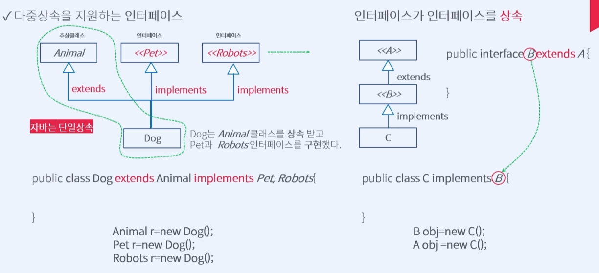

# Course1 Part4 객체지향 프로그래밍 설계하기   

## 추상클래스와 인터페이스

### 목표
> 다형성을 보장하기 위해서 등장한 추상클래스와 인터페이스에 대해 학습한다
---

### 다형성을 보장한다는 의미는 무엇인가?
##### 다형성을 보장한다는 것은 부모가 명령을 내리면 자식이 반드시 동작(반응)을 해야한다는 개념
다형성 보장을 위한 방법
> 전제조건 4가지의 충족(상속, 재정의, 업캐스팅, 동적바인딩)   
> 부모클래스를 추상클래스로 만든다

---

### 추상클래스와 다형성
##### 추상클래스란?
> 1. 다형성을 일부 보장하기 위해서 등장   
> 2. 서로 비슷한 클래스의 공통부분을 묶을 때 사용   
> 3. 단독으로 객체를 생성할 수 없다   
> 4. 부모의 역할로 사용한다(업캐스팅)   
> 5. 구현된 메서드를 가질 수 있다
> 6. 추상 메서드를 가진 클래스이다

---

### 인터페이스의 등장

##### 추상클래스와의 차이점
> 추상클래스가 서로 비슷한 클래스의 공통부분을 묶을 때 사용한다면   
> 인터페이스는 서로 다른 동작을 가지는 클래스를 묶어 동작시킬 때 사용한다

> 추상클래스는 재정의를 의무화해서 다형성을 보장할 수는 있지만, 구현메서드를 가질 수 있어서   
> 서로 다른 동작을 가지는 클래스를 묶을 때는 하위 클래스가 오동작 할 가능성이 있다

---

### 인터페이스와 다형성
##### 인터페이스는 하나의 규약이다
> 클래스 상속과 다르게 인터페이스 상속은 implements 키워드 사용   
> 구현메서드 없이 추상메서드로만 이루어져 있음

##### 인터페이스에서 사용하는 final static 상수
> 예제에서 다뤘던 라디오와 TV채널의 경우 최소,최댓값이 필요하다   
> 이 값은 변하면 안되기 때문에 final키워드로, 인터페이스는 객체생성이 불가하기 때문에   
> static 키워드로 객체를 생성하지 않고 값을 사용할 수 있도록 메모리에 올려줘야 한다   
> => 인터페이스는 추상메서드와 final static 상수만 갖는다

---

### 인터페이스와 다중상속
##### java는 직접적인 다중상속은 지원하지 않고 단일 상속만을 지원한다

##### 구현과 상속이 다르다는 점을 이용하여 다중상속 개념을 구현한다
> 추상클래스를 extends(상속)받는건 한개 뿐이지만   
> 인터페이스를 implements(구현)하는건 위의 단일상속에 해당하지 않는다   
> 즉 인터페이스를 활용하여 여러개의 클래스를 상속 받은 것처럼 다중상속을 구현한다
></img>
---

### 추상클래스와 인터페이스 비교
> </img>