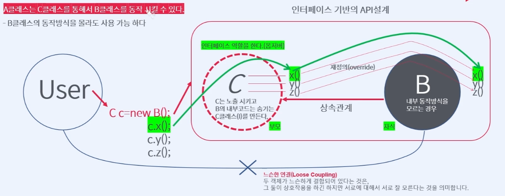

# Course2 Part1 자바 API활용 및 API만들기   

## 인터페이스 기반의 프로그래밍

### 목표
> 자바에서 제공하는 인터페이스를 이용하여 벤더(다른 회사)들이 다양한 API를 만들어서   
> 사용할 수 있는 프로그래밍 기법을 인터페이스 기반의 프로그래밍이라고 한다. 인터페이스를   
> 이용한 API활용 방법을 데이터베이스 측면에서 학습한다
---

### 인터페이스 기반의 프로그래밍이란?
##### API를 어떻게 설계하면 좋을까? => 상속관계로?
> 내부 코드의 직접 노출을 피하면서 사용하기 위해 두 객체를 느슨한 연결로 결합시켜 사용한다   
> 
> 느슨한 연결: 두 객체가 상호작용 하긴 하지만 서로에 대해 잘 모른다는 것을 의미
> 
> 

---

### JDBC Driver란 무엇인가

---

### 인터페이스로 JDBC Driver 연결해보기
